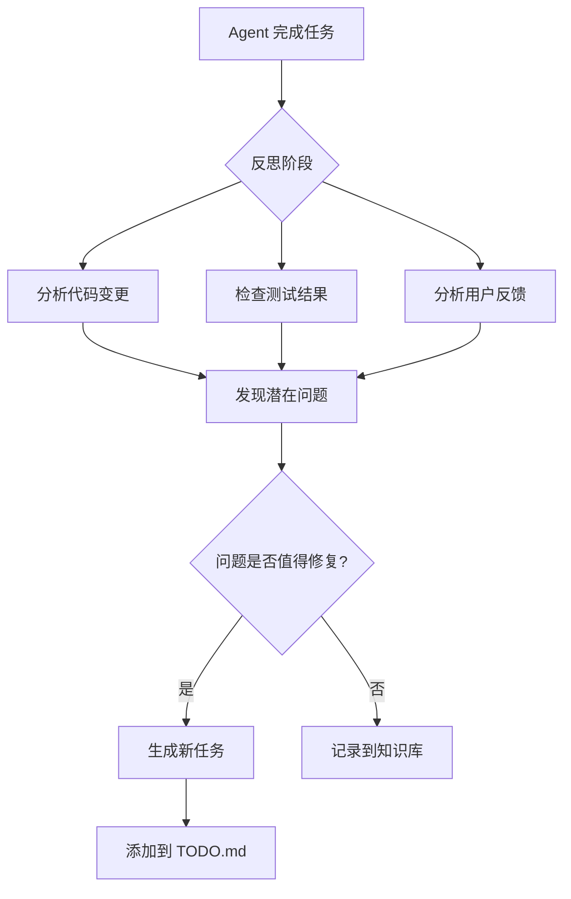

# Agent 自主任务生成机制

## 问题定义

如何让 AI agent 在工作过程中，基于某些框架或规则，自主发现问题、生成新任务，而不仅仅是执行人工定义的任务？

**核心挑战：**
- Agent 如何识别潜在改进点？
- 如何确保生成的任务有价值？
- 如何避免无限生成低质量任务？
- 如何平衡自主性和可控性？

---

## 业界参考

### 1. **Self-Reflection (ReAct, Reflexion)**
Agent 执行任务后，反思结果，发现问题，生成改进任务。

### 2. **Code Review Bots (GitHub Copilot, CodeRabbit)**
自动分析代码，提出改进建议（性能、安全、可读性）。

### 3. **Linting & Static Analysis**
工具（ESLint, SonarQube）自动发现问题，生成修复任务。

### 4. **Test Coverage Analysis**
检测未覆盖代码，生成测试任务。

### 5. **Dependency Update Bots (Dependabot, Renovate)**
自动检测过期依赖，生成更新任务。

---

## 方案设计

### 方案 A：规则驱动的任务生成

**核心思想：** 定义一组规则，agent 定期检查，自动生成任务。

#### 规则框架

```typescript
// 任务生成规则接口
interface TaskGenerationRule {
  name: string;
  description: string;
  // 检查条件
  check(): Promise<boolean>;
  // 生成任务
  generateTask(): Promise<Task>;
  // 优先级（1-10）
  priority: number;
  // 触发频率（每天、每周、每次提交后）
  frequency: 'daily' | 'weekly' | 'on-commit' | 'on-demand';
}

// 任务生成引擎
class TaskGenerationEngine {
  private rules: TaskGenerationRule[] = [];

  registerRule(rule: TaskGenerationRule) {
    this.rules.push(rule);
  }

  async runChecks(): Promise<Task[]> {
    const tasks: Task[] = [];
    for (const rule of this.rules) {
      if (await rule.check()) {
        const task = await rule.generateTask();
        tasks.push(task);
      }
    }
    return tasks.sort((a, b) => b.priority - a.priority);
  }
}
```

#### 示例规则

**规则 1：测试覆盖率不足**

```typescript
const testCoverageRule: TaskGenerationRule = {
  name: 'test-coverage-check',
  description: '检测测试覆盖率，生成测试任务',
  priority: 8,
  frequency: 'on-commit',

  async check(): Promise<boolean> {
    // 运行测试覆盖率检查
    const coverage = await runTestCoverage();
    return coverage.overall < 80; // 低于 80% 触发
  },

  async generateTask(): Promise<Task> {
    const coverage = await runTestCoverage();
    const uncoveredFiles = coverage.files.filter(f => f.coverage < 80);

    return {
      title: `提高测试覆盖率（当前 ${coverage.overall}%）`,
      description: `
以下文件测试覆盖率不足：
${uncoveredFiles.map(f => `- ${f.path}: ${f.coverage}%`).join('\n')}

建议：
1. 为核心逻辑添加单元测试
2. 为 API 端点添加集成测试
3. 为关键用户流程添加 E2E 测试
      `.trim(),
      priority: 8,
      category: 'testing',
      autoGenerated: true,
      generatedBy: 'test-coverage-check',
      generatedAt: new Date().toISOString(),
    };
  },
};
```

**规则 2：代码质量问题**

```typescript
const codeQualityRule: TaskGenerationRule = {
  name: 'code-quality-check',
  description: '运行 linter，生成修复任务',
  priority: 6,
  frequency: 'on-commit',

  async check(): Promise<boolean> {
    const result = await runLinter();
    return result.errorCount > 0 || result.warningCount > 10;
  },

  async generateTask(): Promise<Task> {
    const result = await runLinter();
    const criticalIssues = result.errors.slice(0, 5); // 前 5 个严重问题

    return {
      title: `修复代码质量问题（${result.errorCount} 错误, ${result.warningCount} 警告）`,
      description: `
Linter 检测到以下问题：

严重错误：
${criticalIssues.map(e => `- ${e.file}:${e.line}: ${e.message}`).join('\n')}

建议：
1. 运行 \`bun run lint:fix\` 自动修复
2. 手动检查无法自动修复的问题
3. 更新 .eslintrc 规则（如果规则不合理）
      `.trim(),
      priority: 6,
      category: 'code-quality',
      autoGenerated: true,
    };
  },
};
```

**规则 3：性能问题**

```typescript
const performanceRule: TaskGenerationRule = {
  name: 'performance-check',
  description: '检测性能瓶颈，生成优化任务',
  priority: 7,
  frequency: 'weekly',

  async check(): Promise<boolean> {
    // 分析性能日志
    const metrics = await analyzePerformanceMetrics();
    return metrics.slowEndpoints.length > 0;
  },

  async generateTask(): Promise<Task> {
    const metrics = await analyzePerformanceMetrics();
    const slowest = metrics.slowEndpoints.slice(0, 3);

    return {
      title: `优化性能瓶颈（${metrics.slowEndpoints.length} 个慢端点）`,
      description: `
性能分析发现以下瓶颈：

${slowest.map(e => `- ${e.path}: 平均 ${e.avgTime}ms (P95: ${e.p95}ms)`).join('\n')}

建议：
1. 添加缓存（Redis/内存）
2. 优化数据库查询（添加索引）
3. 使用 CDN 加速静态资源
      `.trim(),
      priority: 7,
      category: 'performance',
      autoGenerated: true,
    };
  },
};
```

**规则 4：依赖更新**

```typescript
const dependencyUpdateRule: TaskGenerationRule = {
  name: 'dependency-update-check',
  description: '检测过期依赖，生成更新任务',
  priority: 5,
  frequency: 'weekly',

  async check(): Promise<boolean> {
    const outdated = await checkOutdatedDependencies();
    return outdated.length > 0;
  },

  async generateTask(): Promise<Task> {
    const outdated = await checkOutdatedDependencies();
    const critical = outdated.filter(d => d.severity === 'high');

    return {
      title: `更新过期依赖（${outdated.length} 个）`,
      description: `
以下依赖有更新：

${critical.map(d => `- ${d.name}: ${d.current} → ${d.latest} (${d.severity})`).join('\n')}

建议：
1. 优先更新安全漏洞相关依赖
2. 阅读 CHANGELOG，检查 breaking changes
3. 运行测试确保兼容性
      `.trim(),
      priority: critical.length > 0 ? 9 : 5,
      category: 'maintenance',
      autoGenerated: true,
    };
  },
};
```

**规则 5：文档缺失**

```typescript
const documentationRule: TaskGenerationRule = {
  name: 'documentation-check',
  description: '检测缺失文档，生成编写任务',
  priority: 4,
  frequency: 'on-commit',

  async check(): Promise<boolean> {
    // 检查新增的公共 API 是否有文档
    const diff = await getGitDiff();
    const newPublicFunctions = parseNewPublicFunctions(diff);
    return newPublicFunctions.some(f => !f.hasDocComment);
  },

  async generateTask(): Promise<Task> {
    const diff = await getGitDiff();
    const undocumented = parseNewPublicFunctions(diff).filter(f => !f.hasDocComment);

    return {
      title: `为新增 API 添加文档（${undocumented.length} 个）`,
      description: `
以下函数缺少文档注释：

${undocumented.map(f => `- ${f.file}:${f.line}: ${f.name}()`).join('\n')}

建议：
1. 添加 JSDoc/TSDoc 注释
2. 说明参数、返回值、异常
3. 添加使用示例
      `.trim(),
      priority: 4,
      category: 'documentation',
      autoGenerated: true,
    };
  },
};
```

**规则 6：技术债务**

```typescript
const technicalDebtRule: TaskGenerationRule = {
  name: 'technical-debt-check',
  description: '检测 TODO/FIXME 注释，生成清理任务',
  priority: 3,
  frequency: 'weekly',

  async check(): Promise<boolean> {
    const todos = await findTodoComments();
    return todos.length > 20; // 超过 20 个 TODO 触发
  },

  async generateTask(): Promise<Task> {
    const todos = await findTodoComments();
    const oldest = todos.sort((a, b) => a.age - b.age).slice(0, 5);

    return {
      title: `清理技术债务（${todos.length} 个 TODO）`,
      description: `
项目中有 ${todos.length} 个 TODO/FIXME 注释，建议清理：

最老的 5 个：
${oldest.map(t => `- ${t.file}:${t.line}: ${t.text} (${t.age} 天前)`).join('\n')}

建议：
1. 完成或删除过时的 TODO
2. 将重要 TODO 转为正式任务
3. 保持 TODO 数量 < 10
      `.trim(),
      priority: 3,
      category: 'maintenance',
      autoGenerated: true,
    };
  },
};
```

---

### 方案 B：AI 驱动的任务发现

**核心思想：** Agent 主动分析代码、日志、用户反馈，发现潜在问题。

#### 工作流



#### 提示词模板

```markdown
# Agent Self-Reflection Prompt

你刚刚完成了任务：{task_title}

请分析以下内容，发现潜在改进点：

## 1. 代码变更分析
你修改的文件：
{changed_files}

问题：
- 是否有重复代码可以抽取？
- 是否有性能问题？
- 是否有安全隐患？
- 是否有更好的设计模式？

## 2. 测试结果分析
测试覆盖率：{coverage}%
失败的测试：{failed_tests}

问题：
- 哪些代码路径未被测试？
- 是否需要添加边界测试？
- 是否需要添加性能测试？

## 3. 用户体验分析
你实现的功能：{feature_description}

问题：
- 是否有更好的交互方式？
- 是否需要添加错误提示？
- 是否需要添加文档？

## 4. 技术债务分析
你添加的 TODO 注释：{todo_comments}

问题：
- 哪些 TODO 应该立即处理？
- 哪些可以转为正式任务？

---

请生成 0-3 个新任务（只生成真正有价值的任务）。

格式：
## 任务标题 [优先级: 1-10]
- 类别：{testing|performance|documentation|refactoring|bug}
- 描述：...
- 理由：为什么这个任务重要？
- 预计时间：...
```

#### 实现示例

```typescript
class AITaskGenerator {
  async generateTasksFromReflection(completedTask: Task): Promise<Task[]> {
    // 收集上下文
    const context = {
      task: completedTask,
      changedFiles: await getChangedFiles(completedTask),
      coverage: await getTestCoverage(),
      failedTests: await getFailedTests(),
      todoComments: await extractTodoComments(completedTask),
    };

    // 调用 AI 反思
    const prompt = this.buildReflectionPrompt(context);
    const response = await callAI(prompt);

    // 解析生成的任务
    const tasks = this.parseGeneratedTasks(response);

    // 过滤低质量任务
    return tasks.filter(t => t.priority >= 5);
  }

  private buildReflectionPrompt(context: any): string {
    // 使用上面的提示词模板
  }

  private parseGeneratedTasks(response: string): Task[] {
    // 解析 AI 返回的任务列表
  }
}
```

---

### 方案 C：混合方案（推荐）

**核心思想：** 结合规则驱动和 AI 驱动，互补优势。

```typescript
class HybridTaskGenerator {
  private ruleEngine = new TaskGenerationEngine();
  private aiGenerator = new AITaskGenerator();

  async generateTasks(trigger: 'on-commit' | 'daily' | 'weekly'): Promise<Task[]> {
    // 1. 规则驱动：快速、确定性
    const ruleTasks = await this.ruleEngine.runChecks();

    // 2. AI 驱动：灵活、创造性（仅在有必要时）
    const aiTasks: Task[] = [];
    if (trigger === 'on-commit' && ruleTasks.length === 0) {
      // 规则未发现问题，让 AI 深度分析
      const lastTask = await getLastCompletedTask();
      aiTasks.push(...await this.aiGenerator.generateTasksFromReflection(lastTask));
    }

    // 3. 去重、排序
    const allTasks = [...ruleTasks, ...aiTasks];
    return this.deduplicateAndRank(allTasks);
  }

  private deduplicateAndRank(tasks: Task[]): Task[] {
    // 去重：相似任务合并
    // 排序：按优先级
    // 限制：最多返回 5 个任务（避免任务爆炸）
  }
}
```

---

## 任务质量控制

### 问题：如何避免生成低质量任务？

#### 1. 任务评分机制

```typescript
interface TaskScore {
  impact: number;      // 影响范围（1-10）
  urgency: number;     // 紧急程度（1-10）
  effort: number;      // 工作量（1-10，越小越好）
  confidence: number;  // 置信度（0-1）
}

function calculateTaskPriority(score: TaskScore): number {
  // 优先级 = (影响 * 紧急程度) / 工作量 * 置信度
  return (score.impact * score.urgency) / score.effort * score.confidence;
}
```

#### 2. 任务审核流程

```markdown
# 自动生成的任务审核流程

1. Agent 生成任务 → 标记为 [🤖自动生成]
2. 人工审核（每周一次）：
   - ✅ 批准 → 转为正式任务
   - 🚫 拒绝 → 删除，记录原因（用于改进规则）
   - ✏️ 修改 → 调整描述后批准
3. 反馈循环：
   - 统计批准率（目标 > 70%）
   - 分析拒绝原因
   - 优化生成规则
```

#### 3. 任务数量限制

```typescript
const TASK_LIMITS = {
  // 每次生成最多 5 个任务
  perGeneration: 5,
  // 待审核任务最多 20 个
  pendingReview: 20,
  // 每个类别最多 3 个任务
  perCategory: 3,
};
```

---

## 实施路线图

### 阶段 1：MVP（1 周）

**目标：** 验证可行性

```bash
# 实现 3 个基础规则
1. 测试覆盖率检查
2. Linter 检查
3. TODO 注释检查

# 手动触发
bun run generate-tasks

# 输出到 TODO.md（标记为自动生成）
```

**成功指标：**
- 生成的任务中，70% 被人工批准
- 发现至少 1 个人工未注意到的问题

---

### 阶段 2：自动化（2 周）

**目标：** 集成到 CI/CD

```yaml
# .github/workflows/task-generation.yml
name: Auto Generate Tasks

on:
  push:
    branches: [main]
  schedule:
    - cron: '0 0 * * 1' # 每周一

jobs:
  generate-tasks:
    runs-on: ubuntu-latest
    steps:
      - uses: actions/checkout@v2
      - run: bun run generate-tasks
      - run: git commit -m "chore: auto-generate tasks"
      - run: git push
```

**成功指标：**
- 每周自动生成 3-5 个任务
- 批准率 > 60%

---

### 阶段 3：AI 增强（1 月）

**目标：** 添加 AI 驱动的任务发现

```typescript
// 集成 AI 反思
on('task-completed', async (task) => {
  const aiTasks = await aiGenerator.generateTasksFromReflection(task);
  await saveTasks(aiTasks);
});
```

**成功指标：**
- AI 生成的任务批准率 > 50%
- 发现至少 2 个规则无法发现的问题

---

## 示例：完整工作流

### 场景：Agent 完成「添加字体缩放功能」

#### 1. 规则驱动检查

```bash
# 运行规则引擎
$ bun run generate-tasks

✅ 测试覆盖率检查: 通过 (85%)
⚠️  Linter 检查: 发现 3 个警告
✅ 性能检查: 通过
✅ 依赖检查: 通过
⚠️  文档检查: 缺少 API 文档

生成任务：
1. [优先级 6] 修复 Linter 警告（3 个）
2. [优先级 4] 为字体缩放 API 添加文档
```

#### 2. AI 驱动反思

```markdown
# AI 反思结果

分析完成的任务「添加字体缩放功能」后，发现以下改进点：

## 生成任务

### 1. 添加字体缩放的键盘快捷键 [优先级: 7]
- 类别：enhancement
- 描述：当前只能通过点击按钮调整，建议添加 Cmd/Ctrl + +/- 快捷键
- 理由：提升用户体验，符合行业标准（浏览器、编辑器都支持）
- 预计时间：30 分钟

### 2. 添加字体缩放的单元测试 [优先级: 6]
- 类别：testing
- 描述：setFontScale() 函数缺少测试覆盖
- 理由：核心功能应该有测试保障
- 预计时间：20 分钟

### 3. 优化字体缩放的过渡动画 [优先级: 4]
- 类别：enhancement
- 描述：当前立即生效，可以添加平滑过渡
- 理由：提升视觉体验，减少突兀感
- 预计时间：15 分钟
```

#### 3. 合并与去重

```typescript
// 最终生成的任务列表
const finalTasks = [
  { priority: 7, title: '添加字体缩放的键盘快捷键' },
  { priority: 6, title: '修复 Linter 警告（3 个）' },
  { priority: 6, title: '添加字体缩放的单元测试' },
  { priority: 4, title: '为字体缩放 API 添加文档' },
  { priority: 4, title: '优化字体缩放的过渡动画' },
];
```

#### 4. 追加到 TODO.md

```markdown
# 待完成功能

## 添加字体缩放的键盘快捷键 [🤖自动生成 - 2026-03-01]
- 生成原因：AI 反思发现用户体验改进点
- 优先级：7
- 描述：添加 Cmd/Ctrl + +/- 快捷键支持
- 预计时间：30 分钟

## 修复 Linter 警告（3 个）[🤖自动生成 - 2026-03-01]
- 生成原因：Linter 规则检查
- 优先级：6
- 描述：
  - src/client/main.ts:123: 未使用的变量 'oldScale'
  - src/client/css.ts:45: 缺少分号
  - src/client/html.ts:67: 字符串应使用单引号
```

---

## 监控与优化

### 关键指标

```typescript
interface TaskGenerationMetrics {
  // 生成效率
  totalGenerated: number;      // 总生成数量
  approvalRate: number;        // 批准率
  rejectionReasons: string[];  // 拒绝原因

  // 任务质量
  avgPriority: number;         // 平均优先级
  avgCompletionTime: number;   // 平均完成时间

  // 规则效果
  ruleEffectiveness: Map<string, number>; // 每个规则的批准率
}
```

### 优化循环

```markdown
# 每月优化流程

1. 分析指标：
   - 哪些规则批准率高？（保留并优化）
   - 哪些规则批准率低？（调整或删除）
   - AI 生成的任务质量如何？（调整提示词）

2. 调整规则：
   - 提高优先级阈值（减少低优先级任务）
   - 优化任务描述模板（更清晰）
   - 添加新规则（基于人工任务模式）

3. 反馈给 AI：
   - 收集被拒绝的任务示例
   - 训练 AI 识别低质量任务
   - 优化反思提示词
```

---

## 总结

### 推荐方案：混合方案

**短期（1-2 周）：**
- ✅ 实现 3-5 个规则驱动的任务生成器
- ✅ 手动触发，输出到 TODO.md
- ✅ 人工审核，收集反馈

**中期（1-2 月）：**
- ✅ 集成到 CI/CD，自动触发
- ✅ 添加 AI 驱动的反思机制
- ✅ 优化任务质量控制

**长期（3-6 月）：**
- ✅ 根据批准率动态调整规则
- ✅ AI 学习人工任务模式
- ✅ 实现完全自主的任务生成

### 核心原则

1. **质量 > 数量** - 宁可少生成，不要生成垃圾任务
2. **可解释性** - 每个任务都要说明生成原因
3. **人工审核** - 初期必须人工审核，逐步放宽
4. **反馈循环** - 持续优化，提高批准率
5. **可控性** - 提供开关，可随时禁用

---

**下一步：** 实现 MVP，验证可行性
