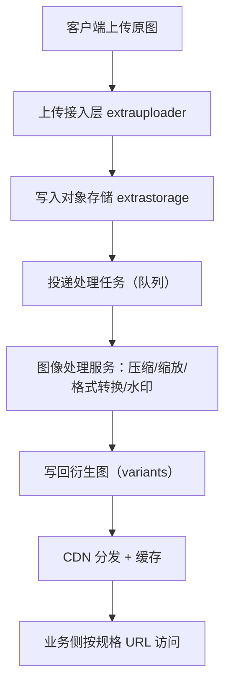
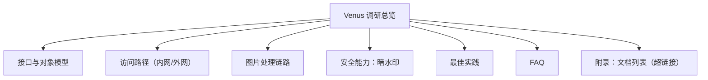

# Venus 图片服务调研补充（2026-03-02）

> 状态说明：
> - 当前仓库内可直接读取到的 Venus 调研文档只有本文件（原内容已被覆盖）。
> - 下述“已确认线索”来自本仓库中残留的接口片段与命名。
> - “实现建议/最佳实践/FAQ”为行业通用方案，并标注为推断。

## 0. 已确认线索（仓库内）

### 0.1 相关域名与接口片段

- 上传域名片段：`extrauploader.inf.test.sankuai.com`
- 存储接口片段：
  - `POST /extrastorage/<bucket>`
  - `POST /extrastorage/new/<bucket>`
- 对象标识片段：
  - `fileKey` 形如：`/bucket/filename.ext`

### 0.2 关键信息可信度

- 高：接口路径命名模式（`extrastorage/*`）
- 中：`fileKey` 语义（路径样式明确，但字段契约未拿到正式 schema）
- 低：服务端内部处理流水线细节（目前无官方内部文档）

---

## 1) 图片实时处理：是怎么做的？

结论先行：通常有两种“实时”。

1. 读时实时（on-the-fly）
- 用户第一次请求某变换规格时才处理
- 处理结果落盘并走 CDN 缓存
- 首次慢，后续快

2. 写时实时（eager/async on upload）
- 上传后立即异步生成常用规格（缩略图、WebP/AVIF、多尺寸）
- 首次访问也快，但上传链路更复杂

结合现有接口命名（`extrauploader` + `extrastorage`），更像是“上传入口 + 存储层 + 异步处理”的组合架构。

### 推荐流水线（推断）

### 设计要点（推断）

- 处理任务必须幂等（同一 `fileKey + spec` 重试不重复产物）
- 原图与衍生图解耦存储（便于回刷策略）
- URL 规格化（同义参数去重，提升缓存命中）

---

## 2) 外网和内网访问的区别

典型差异如下（通用方案，结合域名形态推断）：

1. 网络入口
- 内网：走公司内 DNS/VIP，低延迟、可直连内部服务
- 外网：走公网网关/CDN/WAF，路径更长但可全球访问

2. 鉴权方式
- 内网：更常见服务身份鉴权（机器身份、短期 token）
- 外网：更常见签名 URL、STS、防盗链、Referer/UA 限制

3. 能力暴露
- 内网：可开放更多管理能力（元数据查询、批处理）
- 外网：倾向最小暴露（上传/下载/固定规格访问）

4. 安全与合规
- 外网必须强化：限流、内容审核、恶意文件扫描、跨地域合规
- 内网重点：权限边界、横向访问控制、审计留痕

---

## 3) 文档树（查看记录）+ 文档列表移到附录

### 3.1 文档树

### 3.2 查看记录（本轮）

- 对仓库 `docs/` 检索后，仅发现本文件与 Venus 相关
- 历史版本无法从当前 git 记录恢复（说明该文件此前未入库或被覆盖）
- 因此本次先输出“可执行补充版”，待拿到内部原始文档后再二次校对

---

## 4) 暗水印：是什么、用在什么场景、怎么实现、注意什么

### 4.1 是什么

- 暗水印（Invisible Watermark）是在视觉上基本不可见、但可被算法检测/解码的嵌入信息
- 典型载荷：用户/组织 ID、时间戳、渠道、追踪 nonce

### 4.2 使用场景

1. 外泄追踪（内部文档/图片被截图传播后的归因）
2. 版权声明与证据增强
3. 平台内容来源追踪（AIGC/媒体分发）

### 4.3 大概实现（工程视角）

1. 嵌入
- 生成 payload（如 `uid + ts + hmac`）
- 嵌入到频域或像素域（常见 DCT/DWT/patch-based）
- 控制强度，平衡不可感知与鲁棒性

2. 检测/解码
- 对疑似泄露图做归一化与抗攻击预处理（裁剪、压缩、缩放纠偏）
- 提取 watermark bit 并做纠错解码
- 与签名/HMAC 校验真实性

### 4.4 注意事项

1. 不要把暗水印当成“不可移除”的绝对安全能力
- 近年的研究表明，生成式重绘/再生成可显著削弱或伪造水印

2. 法务链路要闭环
- 需要保存嵌入策略版本、密钥版本、检测日志与时间证据

3. 体验与性能权衡
- 嵌入强度过高会伤画质；过低在压缩/裁剪后难检出

---

## 5) 最佳实践（提取关键点）

1. 变换策略分层
- 热门规格用“写时异步预生成”
- 长尾规格用“读时生成 + 持久化缓存”

2. 缓存策略
- 使用版本化 URL（内容变更即版本变）
- 明确 `Cache-Control` 与 `ETag`，避免脏缓存

3. 安全策略
- 上传白名单 + MIME 二次校验 + 病毒扫描
- 外网访问全部走签名 URL + 过期时间 + 最小权限

4. 稳定性
- 处理任务全链路幂等、可重放、可追踪（traceId）
- 失败重试分级：瞬时错误重试，参数错误快速失败

5. 可观测性
- 指标最少覆盖：上传成功率、处理成功率、P95 处理时延、缓存命中率、回源率

---

## 6) FAQ（提取关键点）

### Q1：为什么首次打开慢、第二次快？
- 首次通常触发变换生成；后续命中存储/CDN 缓存。

### Q2：图更新了但还看到旧图？
- 多半是 CDN/浏览器缓存未失效；应使用版本化 URL 或主动失效。

### Q3：为什么同一张图在不同端大小差异大？
- 可能是不同质量参数、格式协商（WebP/AVIF/JPEG）或 DPR 策略差异。

### Q4：暗水印能否作为唯一防泄漏手段？
- 不建议。应与访问控制、可见水印、审计与法务取证一起使用。

### Q5：外网上传最容易出什么问题？
- 过期签名、时钟偏差、MIME 不一致、超大图处理超时、限流触发。

---

## 附录 A：文档列表（标题列为超链接）

| 标题 | 链接 | 说明 |
|---|---|---|
| [Venus 调研补充（本页）](./20260302-venus-api-research.md) | `docs/research/20260302-venus-api-research.md` | 当前汇总文档 |
| [美团技术：数据安全保护新探索（水印背景）](https://tech.meituan.com/2018/05/20/data-security-protection-new-exploration.html) | 外部公开文章 | 水印与溯源背景 |
| [AWS：Serverless File Processing](https://docs.aws.amazon.com/lambda/latest/dg/file-processing-app.html) | 官方文档 | 上传后异步处理参考架构 |
| [Cloudinary：On-the-fly vs Eager Transformations](https://support.cloudinary.com/hc/en-us/articles/202521172-Should-I-use-on-the-fly-or-eager-transformations) | 官方支持文档 | 实时处理两种模式对比 |
| [Cloudinary：Caching Images](https://cloudinary.com/glossary/caching-images) | 官方资料 | 缓存与性能要点 |
| [论文：Invisible Image Watermarks Are Provably Removable Using Generative AI](https://arxiv.org/abs/2306.01953) | 学术论文 | 暗水印鲁棒性边界 |

## 附录 B：后续待补（拿到内部文档后）

1. Venus 官方 API schema（请求/响应字段、错误码）
2. 正式 FAQ 全量条目
3. 内外网路由与鉴权链路图（以真实环境配置为准）
