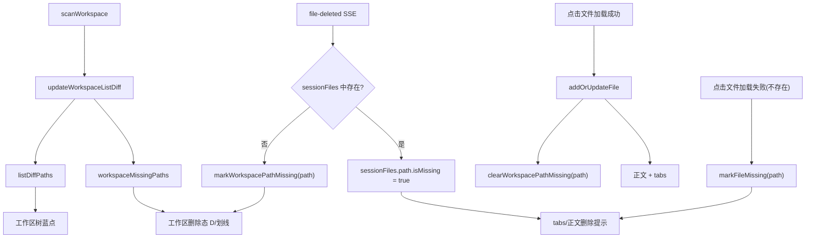

# 客户端状态模型（Session vs Workspace）

日期：2026-03-02

## 1. 目标

将两类状态彻底区分，避免“文件是否打开过”影响“工作区真实状态”：

1. `sessionFiles`：会话缓存（tab/正文缓存/同步上下文）
2. `workspace`：目录真实状态（树结构、蓝点、删除态）

## 2. 状态边界

### 2.1 Session（会话态）

来源：
- 用户点击文件（加载成功）
- CLI `open-file` 推送
- 恢复 localStorage

数据：
- `state.sessionFiles: Map<path, FileInfo>`
- `state.currentFile`

职责：
- 渲染 tabs
- 渲染当前正文
- 提供同步上下文（当前文件路径、标题、上次同步记录）

不负责：
- 工作区全量文件存在性
- 未打开文件的删除检测

### 2.2 Workspace（工作区态）

来源：
- `scanWorkspace` 返回目录树
- 差异计算（新增/消失）
- watcher/SSE 的删除事件补充

数据：
- `state.fileTree`（工作区树）
- `workspaceKnownFiles`（上次扫描快照）
- `listDiffPaths`（蓝点）
- `workspaceMissingPaths`（删除态）

职责：
- 渲染工作区树
- 渲染蓝点/删除态（即使文件未被打开）

## 3. 关键迁移规则

1. `scanWorkspace` 后：
- 新文件：加入蓝点
- 消失文件：加入 `workspaceMissingPaths`
- 重新出现文件：移除 `workspaceMissingPaths`

2. 文件点击行为：
- 加载成功：进入 `sessionFiles`，并清除其 `workspaceMissingPaths`
- 加载失败（不存在）：进入 missing 展示（有缓存则展示缓存；无缓存则展示占位提示）

3. 删除事件行为：
- 如果文件已在 `sessionFiles`：标记 `isMissing`
- 否则：仅标记 `workspaceMissingPaths`（不污染 tabs）

## 3.1 状态迁移图（事件 -> 状态 -> UI）

## 3.2 模块分层

- `workspace-state-diff.ts`
  - `listDiffPaths`
  - `updateWorkspaceListDiff`
  - `removeWorkspaceTracking`
  - `restoreWorkspaceAuxiliaryState`
- `workspace-state-missing.ts`
  - `workspaceMissingPaths`
  - missing 查询与标记 API
- `workspace-state-persistence.ts`
  - `workspaceKnownFiles` 持久化与恢复
- `workspace-state.ts`
  - facade 出口，供业务模块稳定引用

## 4. 现状与完成项

已完成：
- `state.files` 已更名为 `state.sessionFiles`（语义明确）
- 工作区删除态不再依赖“是否打开过”
- 工作区状态已拆分到独立模块：`src/client/workspace-state.ts`
- 新增正式回归 case：`tests/e2e/cases/case-15/`（未打开文件删除后立即显示删除态）

本轮完成：
1. 已补充 `workspace-state-diff` 细粒度单测：
- `tests/unit/workspace-state-diff.test.ts`
2. 已将同步状态从 `sessionFiles` 中拆分：
- 新增 `src/client/sync-state.ts`
- `FileInfo` 移除 `synced*` 字段，转由 `sync-state` 独立维护（含本地持久化）
