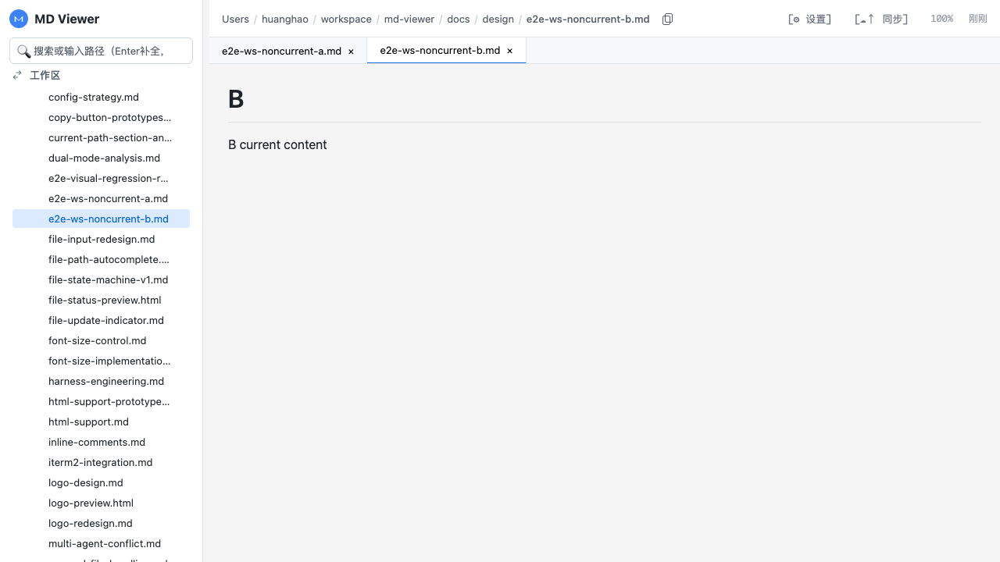
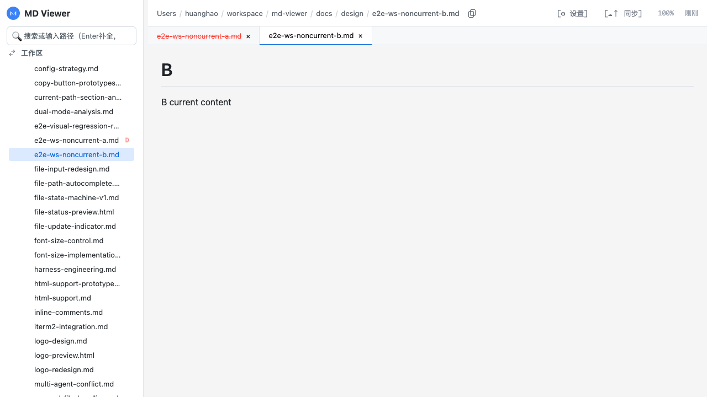
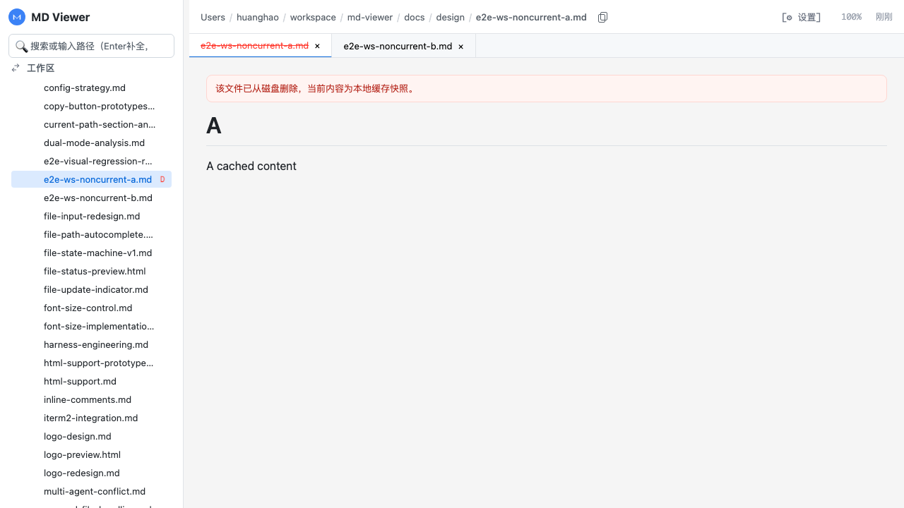

# Case 14: 工作区模式下删除非当前文件

## 目的
验证在**工作区模式**中，删除一个**非当前文件**后的交互一致性：

1. 该文件在树中进入删除态（`D`）
2. 点击该文件时，显示删除提示并保留缓存正文
3. 刷新页面后，该文件从工作区树移除

## 前置
- 侧边栏模式为 `workspace`
- 工作区包含 `tests/e2e/runtime/case-14`
- 存在两个测试文件：
  - `e2e-ws-noncurrent-a.md`（将被删除）
  - `e2e-ws-noncurrent-b.md`（当前文件）

## 断言
- 删除后 `A` 节点出现 `D` 状态
- 点击 `A` 后内容区出现 `.content-file-status.deleted`
- 内容区仍可看到 `A cached content`
- `page.reload()` 后树中不再出现 `A`

## 录屏
- 演示视频：`assets/case-14-demo.webm`
- 顺序步骤视频（无覆盖标记）：`assets/case-14-steps.webm`
- 兼容格式（无覆盖标记）：`assets/case-14-steps.mp4`
- 快速预览（GIF）：`assets/case-14-demo.gif`

<video src="./assets/case-14-steps.webm" controls playsinline preload="metadata" width="960"></video>

## 关键画面
### Step 1: 删除前（B 为当前，A 为非当前）

### Step 2: 删除 A 后，树节点出现 `D`

### Step 3: 点击 A，正文显示删除提示并保留缓存内容

