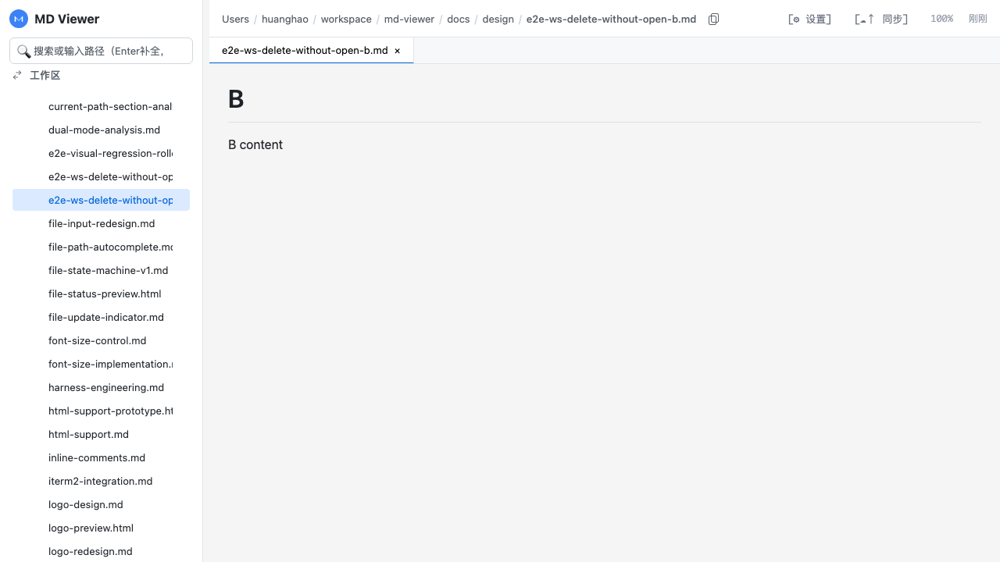
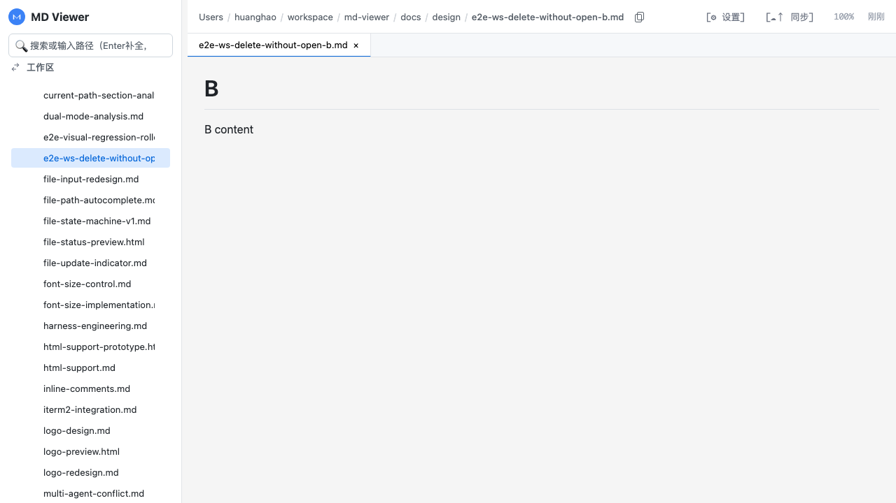
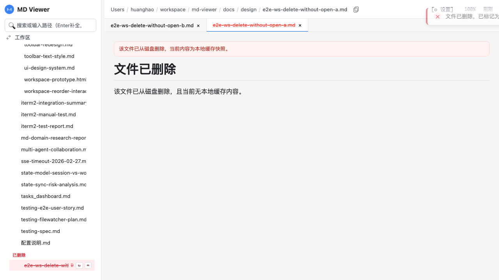

# Case 15: 工作区中未打开文件删除后立即显示删除态

## 目的
验证在工作区模式下，**未打开文件**被删除后，不需要先点击该文件，也会立即显示删除态。

## 前置
- 侧边栏模式为 `workspace`
- 工作区包含 `docs`
- 准备两个文件：
  - `e2e-ws-delete-without-open-a.md`（将被删除，且不先打开）
  - `e2e-ws-delete-without-open-b.md`（打开后作为当前文件）

## 断言
1. 删除 `A` 后，侧栏立即出现 `A` 的删除态行（`D` + 红色划线）。
2. 点击删除态行后，正文显示删除提示。
3. 正文显示“无本地缓存内容”。

## 录屏
- 顺序步骤视频：`assets/case-15-steps.webm`
- 兼容格式：`assets/case-15-steps.mp4`

<video src="./assets/case-15-steps.webm" controls playsinline preload="metadata" width="960"></video>

## 关键画面
### Step 1: 删除前（仅打开 B，A 未打开）

### Step 2: 删除 A 后立即出现删除态（D + 划线）

### Step 3: 点击删除态项，正文显示删除提示（无缓存）

